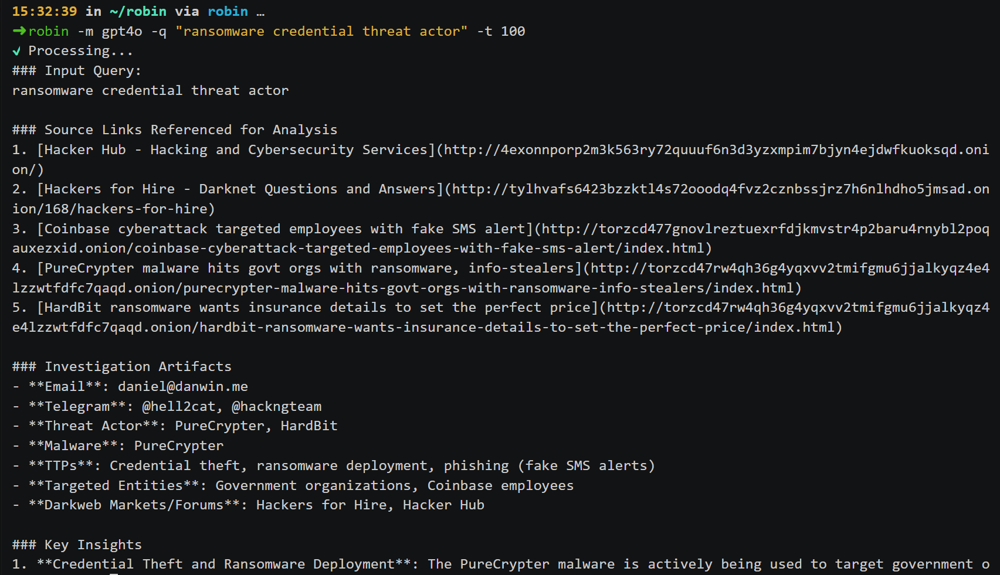

<div align="center">
   
   <br><a href="https://github.com/apurvsinghgautam/robin/actions/workflows/binary.yml"></a> <a href="https://github.com/apurvsinghgautam/robin/releases"></a> <a href="https://hub.docker.com/r/apurvsg/robin"></a>
   <h1>Robin: AI-Powered Dark Web OSINT Tool</h1>

   <p>Robin is an AI-powered tool for conducting dark web OSINT investigations. It leverages LLMs to refine queries, filter search results from dark web search engines, and provide an investigation summary.</p>
   <a href="#installation">Installation</a> &bull; <a href="#usage">Usage</a> &bull; <a href="#contributing">Contributing</a> &bull; <a href="#acknowledgements">Acknowledgements</a><br><br>
</div>




---

## Features

- ⚙️ **Modular Architecture** – Clean separation between search, scrape, and LLM workflows.
- 🤖 **Multi-Model Support** – Easily switch between OpenAI, Claude, Gemini or local models like Ollama.
- 🔐 **Google Pro OAuth** – Use your Google subscription for free Gemini access (no API key needed).
- 💻 **CLI-First Design** – Built for terminal warriors and automation ninjas.
- 🐳 **Docker-Ready** – Optional Docker deployment for clean, isolated usage.
- 📝 **Custom Reporting** – Save investigation output to file for reporting or further analysis.
- 🧩 **Extensible** – Easy to plug in new search engines, models, or output formats.

---

## ⚠️ Disclaimer
> This tool is intended for educational and lawful investigative purposes only. Accessing or interacting with certain dark web content may be illegal depending on your jurisdiction. The author is not responsible for any misuse of this tool or the data gathered using it.
>
> Use responsibly and at your own risk. Ensure you comply with all relevant laws and institutional policies before conducting OSINT investigations.
>
> Additionally, Robin leverages third-party APIs (including LLMs). Be cautious when sending potentially sensitive queries, and review the terms of service for any API or model provider you use.

## Installation
> [!NOTE]
> Robin requires Tor to search the dark web. You have two options:
> - **Tor Browser** (recommended): Install and run [Tor Browser](https://www.torproject.org/download/). Robin uses port 9150 by default.
> - **Tor Service**: Install via `apt install tor` (Linux/WSL) or `brew install tor` (Mac). Uses port 9050.

> [!TIP]
> **API Keys vs OAuth Authentication:**
> - **API Keys**: Set `OPENAI_API_KEY`, `ANTHROPIC_API_KEY`, or `GOOGLE_API_KEY` in your `.env` file
> - **Google Pro OAuth** (Free): Use your Google subscription without API keys. See [Google Pro Setup](#google-pro-oauth-setup) below.

### Docker (Web UI Mode) [Recommended]

- Pull the latest Robin docker image
```bash
docker pull apurvsg/robin:latest
```

- Run the docker image as:
```bash
docker run --rm \
   -v "$(pwd)/.env:/app/.env" \
   --add-host=host.docker.internal:host-gateway \
   -p 8501:8501 \
   apurvsg/robin:latest ui --ui-port 8501 --ui-host 0.0.0.0
```

### Release Binary (CLI Mode)

- Download the appropriate binary for your system from the [latest release](https://github.com/apurvsinghgautam/robin/releases/latest)
- Unzip the file, make it executable 
```bash
chmod +x robin
```

- Run the binary as:
```bash
robin cli --model gpt-4.1 --query "ransomware payments"
```

### Using Python (Development Version)

- With `Python 3.10+` installed, run the following:

```bash
pip install -r requirements.txt
python main.py cli -m gpt-4.1 -q "ransomware payments" -t 12
```

---

## Google Pro OAuth Setup

Use your Google subscription for free Gemini access without API keys.

### 1. Add OAuth Credentials

Add to your `.env` file:
```bash
GOOGLE_CLIENT_ID=your_oauth_client_id
GOOGLE_CLIENT_SECRET=your_oauth_client_secret
```

### 2. Authenticate

**Via CLI:**
```bash
python main.py login    # Opens browser for Google OAuth
python main.py status   # Check authentication status
python main.py logout   # Clear cached credentials
```

**Via Web UI:**
1. Run `streamlit run ui.py`
2. Click "🔑 Login with Google" in the sidebar
3. Complete the OAuth flow

### 3. Use OAuth Models

Once authenticated, select models like `gemini-3-flash` or `gemini-3-pro` in the UI/CLI.

---

## Usage

```bash
Robin: AI-Powered Dark Web OSINT Tool

Commands:
  cli      Run Robin in CLI mode
  ui       Run Robin in Web UI mode
  login    Authenticate with Google for Pro subscription access
  logout   Clear cached Google authentication
  status   Check Google Pro authentication status

CLI Options:
  --model, -m    Select LLM model (gpt-4.1, claude-sonnet-4-0, gemini-3-flash, etc.)
  --query, -q    Dark web search query
  --threads, -t  Number of threads for scraping (Default: 5)
  --output, -o   Filename for the intelligence summary

Example commands:
 - robin cli -m gpt-4.1 -q "ransomware payments" -t 12
 - robin cli -m gemini-3-flash -q "zero days"
 - robin login
 - robin status
```

---

## Contributing

Contributions are welcome! Please feel free to submit a Pull Request if you have major feature updates.

- Fork the repository
- Create your feature branch (git checkout -b feature/amazing-feature)
- Commit your changes (git commit -m 'Add some amazing feature')
- Push to the branch (git push origin feature/amazing-feature)
- Open a Pull Request

Open an Issue for any of these situations:
- If you spot a bug or bad code
- If you have a feature request idea
- If you have questions or doubts about usage
- If you have minor code changes

---

## Acknowledgements

- Idea inspiration from [Thomas Roccia](https://x.com/fr0gger_) and his demo of [Perplexity of the Dark Web](https://x.com/fr0gger_/status/1908051083068645558).
- Tools inspiration from my [OSINT Tools for the Dark Web](https://github.com/apurvsinghgautam/dark-web-osint-tools) repository.
- LLM Prompt inspiration from [OSINT-Assistant](https://github.com/AXRoux/OSINT-Assistant) repository.
- Logo Design by my friend [Tanishq Rupaal](https://github.com/Tanq16/)
- Workflow Design by [Chintan Gurjar](https://www.linkedin.com/in/chintangurjar)


