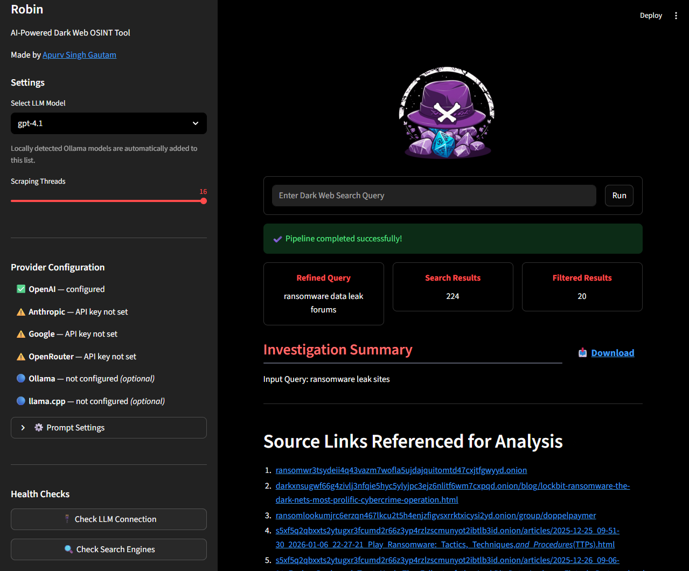
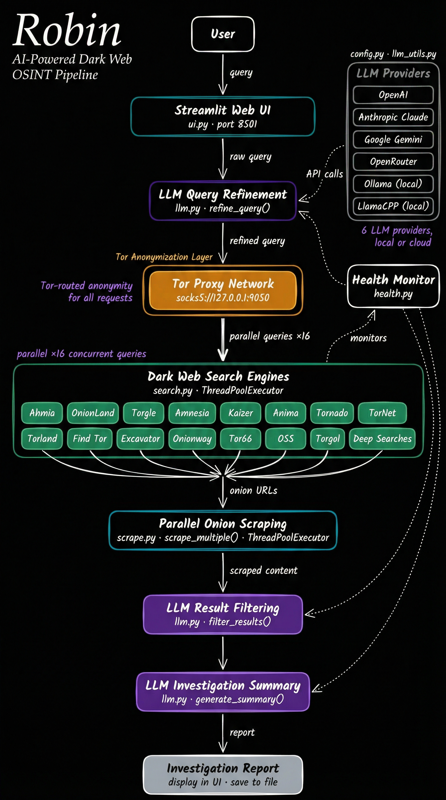

<div align="center">
   
   <br><a href="https://github.com/apurvsinghgautam/robin/actions/workflows/release.yml"></a> <a href="https://github.com/apurvsinghgautam/robin/releases"></a> <a href="https://hub.docker.com/r/apurvsg/robin"></a>
   <p align="center">
 <a href="https://www.star-history.com/apurvsinghgautam/robin"> </a>
</p>
   <h1>Robin: AI-Powered Dark Web OSINT Tool</h1>

   <p>Robin is an AI-powered tool for conducting dark web OSINT investigations. It leverages LLMs to refine queries, filter search results from dark web search engines, and provide an investigation summary.</p>
   <a href="#installation">Installation</a> &bull; <a href="#robin-as-mcp">Robin as MCP</a> &bull; <a href="TROUBLESHOOTING.md">Troubleshooting</a> &bull; <a href="CONTRIBUTING.md">Contributing</a> &bull; <a href="#acknowledgements">Acknowledgements</a><br><br>
</div>




## Architecture


---

## Features

- 🤖 **Multi-Model Support** – OpenAI, Claude, Gemini, Mistral, OpenRouter, Ollama, or any OpenAI-compatible API (LM Studio, llama.cpp, Groq, etc.).
- 🌐 **Web UI** – Streamlit-based interface for interactive investigations.
- 🔌 **MCP Support** – Run Robin from any MCP-capable agent, using that agent's own model. See [Robin as MCP](#robin-as-mcp).
- 💬 **Conversational Follow-ups** – Ask grounded follow-up questions about an investigation without re-running the search, answered from that investigation's own data.
- 🔀 **One-Click Pivots** – Suggested follow-up queries surfaced from the findings; click one to launch a fresh investigation.
- 🐳 **Docker-Ready** – Recommended Docker deployment for clean, isolated usage.

---

## ⚠️ Disclaimer
> This tool is intended for educational and lawful investigative purposes only. Accessing or interacting with certain dark web content may be illegal depending on your jurisdiction. The author is not responsible for any misuse of this tool or the data gathered using it.
>
> Use responsibly and at your own risk. Ensure you comply with all relevant laws and institutional policies before conducting OSINT investigations.
>
> Additionally, Robin leverages third-party APIs (including LLMs). Be cautious when sending potentially sensitive queries, and review the terms of service for any API or model provider you use.

## Installation
> [!NOTE]
> The tool needs Tor to do the searches. You can install Tor using `apt install tor` on Linux/Windows(WSL) or `brew install tor` on Mac. Once installed, confirm if Tor is running in the background.

> [!TIP]
> Provide your API key either in a `.env` file (copy [`.env.example`](.env.example)) or as environment variables. One key is enough: Robin lists models for whichever providers it finds. Supported keys are `OPENAI_API_KEY`, `ANTHROPIC_API_KEY`, `GOOGLE_API_KEY`, `MISTRAL_API_KEY` and `OPENROUTER_API_KEY`.
>
> For Ollama, nothing goes in your `.env`. Robin defaults to `http://host.docker.internal:11434`, which is what the recommended Docker install needs. Two things are still on you:
>
> 1. Run the container with `--add-host=host.docker.internal:host-gateway` (the README command already does).
> 2. Make Ollama listen on all interfaces, since it binds to `127.0.0.1` by default and a container cannot reach that. If you start it yourself, `OLLAMA_HOST=0.0.0.0 ollama serve &`. If it runs under systemd, `sudo systemctl edit ollama.service`, add `[Service]` and `Environment="OLLAMA_HOST=0.0.0.0"`, then `sudo systemctl daemon-reload && sudo systemctl restart ollama`.
>
> See [TROUBLESHOOTING.md](TROUBLESHOOTING.md) if it still doesn't appear.
>
> For any other OpenAI-compatible provider (LM Studio, llama.cpp, Groq, etc.), use the **🔌 Custom API Provider** expander in the sidebar — no `.env` changes required. Enter the base URL, an optional API key, and optionally a model name if the provider doesn't expose `/v1/models` for auto-discovery.

### Docker [Recommended]

- Pull the latest Robin docker image
```bash
docker pull apurvsg/robin:latest
```

- Create a `.env` file in the folder you run from, with your API key in it (see [`.env.example`](.env.example)). Create it before the first run: if it does not exist, Docker mounts an empty folder in its place and Robin starts with no keys.
```bash
touch .env   # then add your API key to it
```

- Run the docker image as:
```bash
docker run --rm \
   -v "$(pwd)/.env:/app/.env" \
   --add-host=host.docker.internal:host-gateway \
   -p 8501:8501 \
   apurvsg/robin:latest
```

> [!TIP]
> To persist saved investigations across Docker restarts, mount a named volume or a local directory at `/app/investigations`.
>
> A named volume works the same on every OS and needs no host path. It is also the volume the agent commands in [Robin as MCP](#robin-as-mcp) mount, so the UI shows the same reports your agent saved:
> ```bash
> docker run --rm \
>    -v "$(pwd)/.env:/app/.env" \
>    -v robin-investigations:/app/investigations \
>    --add-host=host.docker.internal:host-gateway \
>    -p 8501:8501 \
>    apurvsg/robin:latest
> ```
> Or mount a local directory, if you want the JSON files on your own disk:
> ```bash
> docker run --rm \
>    -v "$(pwd)/.env:/app/.env" \
>    -v "$(pwd)/investigations:/app/investigations" \
>    --add-host=host.docker.internal:host-gateway \
>    -p 8501:8501 \
>    apurvsg/robin:latest
> ```
> Investigations are saved to the `investigations/` folder in your working directory and can be loaded from the **Past Investigations** panel in the sidebar.
>
> Create the folder yourself first (`mkdir -p investigations`) so Docker does not create it as root. The container runs as UID 1000, and on Linux a folder owned by anyone else is read-only to it — Robin prints one warning and the save fails, though the investigation still runs. If you hit that, or your own UID isn't 1000, use the named volume above, or see [Saved investigations fail with permission denied on Linux](TROUBLESHOOTING.md#saved-investigations-fail-with-permission-denied-on-linux).

- Open your browser and navigate to `http://localhost:8501`

### Build it yourself

To run your own build instead of the published image, clone the repository and
build it:

```bash
docker build -t robin .
```

Then use the same run commands with `robin` in place of `apurvsg/robin:latest`:

```bash
docker run --rm \
   -v "$(pwd)/.env:/app/.env" \
   --add-host=host.docker.internal:host-gateway \
   -p 8501:8501 \
   robin
```

```bash
docker run --rm \
   -v "$(pwd)/.env:/app/.env" \
   -v "$(pwd)/investigations:/app/investigations" \
   --add-host=host.docker.internal:host-gateway \
   -p 8501:8501 \
   robin
```

- Open your browser and navigate to `http://localhost:8501`

---

## Robin as MCP

Any LLM service that speaks MCP can run it, using its own model. The sections
below are worked examples for the common hosts; a host that is not listed works
the same way, with whatever wording it uses for "add an MCP server".

### Claude Code

```bash
claude mcp add robin -- docker run -i --rm -v robin-investigations:/app/investigations apurvsg/robin mcp
```

Or check it into the project in `.mcp.json`. A Tor investigation takes minutes,
so raise the per-server timeout:

```json
{
  "mcpServers": {
    "robin": {
      "command": "docker",
      "args": ["run", "-i", "--rm", "-v", "robin-investigations:/app/investigations", "apurvsg/robin", "mcp"],
      "timeout": 600000
    }
  }
}
```

### Codex

```bash
codex mcp add robin -- docker run -i --rm -v robin-investigations:/app/investigations apurvsg/robin mcp
```

The ChatGPT desktop app shares this host: adding Robin under **Settings → MCP
servers** there writes the same configuration, and its tools appear in Codex
sessions rather than in an ordinary ChatGPT chat.

A Tor search usually takes a couple of minutes, which can outlast Codex's default
MCP tool timeout, so raise the limits in `~/.codex/config.toml`:

```toml
[mcp_servers.robin]
command = "docker"
args = ["run", "-i", "--rm", "-v", "robin-investigations:/app/investigations", "apurvsg/robin", "mcp"]
tool_timeout_sec = 600
startup_timeout_sec = 60

# Only for non-interactive runs (`codex exec`): Codex declines MCP tool calls
# that would need approval, so pre-approve Robin's read-only tools.
default_tools_approval_mode = "approve"
```

Pull the image first (`docker pull apurvsg/robin:latest`) so the first start is
not also a download.

### Claude Desktop

Add this to `claude_desktop_config.json` and restart the app:

```json
{
  "mcpServers": {
    "robin": {
      "command": "docker",
      "args": ["run", "-i", "--rm", "-v", "robin-investigations:/app/investigations", "apurvsg/robin", "mcp"]
    }
  }
}
```

### Hermes

In `~/.hermes/config.yaml`:

```yaml
mcp_servers:
  robin:
    command: docker
    args: [run, -i, --rm, -v, "robin-investigations:/app/investigations", apurvsg/robin, mcp]
    timeout: 600
```

### OpenClaw

```bash
openclaw mcp add robin --command docker --arg run --arg -i --arg --rm --arg -v --arg robin-investigations:/app/investigations --arg apurvsg/robin --arg mcp
```

Or in the config, under `mcp.servers`:

```json
{
  "mcp": {
    "servers": {
      "robin": {
        "transport": "stdio",
        "command": "docker",
        "args": ["run", "-i", "--rm", "-v", "robin-investigations:/app/investigations", "apurvsg/robin", "mcp"],
        "requestTimeoutMs": 600000
      }
    }
  }
}
```

### ChatGPT

The desktop app's **Settings → MCP servers** configures the Codex host that the
app, the Codex CLI and the IDE extension share, so add Robin there and it
appears in Codex sessions: see [Codex](#codex). An ordinary ChatGPT chat cannot
run it, because chat reaches MCP servers through connectors that run in OpenAI's
infrastructure rather than on your machine.

### Security

- Nothing sends, executes, or runs a shell. The only writes are saved reports,
  into `investigations/` under a filename Robin picks; the agent never names a
  path.
- Searches, page scrapes and search-engine health checks go through Tor, so the
  app you are using never fetches a dark web page itself. Model provider calls
  and the model list refresh go directly, not through Tor.
- Scraped text comes back inside untrusted-data delimiters, with control,
  zero-width and bidi characters stripped first, so your model reads it as
  evidence rather than as instructions.

---

## Acknowledgements

- Idea inspiration from [Thomas Roccia](https://x.com/fr0gger_) and his demo of [Perplexity of the Dark Web](https://x.com/fr0gger_/status/1908051083068645558).
- Tools inspiration from my [OSINT Tools for the Dark Web](https://github.com/apurvsinghgautam/dark-web-osint-tools) repository.
- LLM Prompt inspiration from [OSINT-Assistant](https://github.com/AXRoux/OSINT-Assistant) repository.
- Logo Design by my friend [Tanishq Rupaal](https://github.com/Tanq16/)
